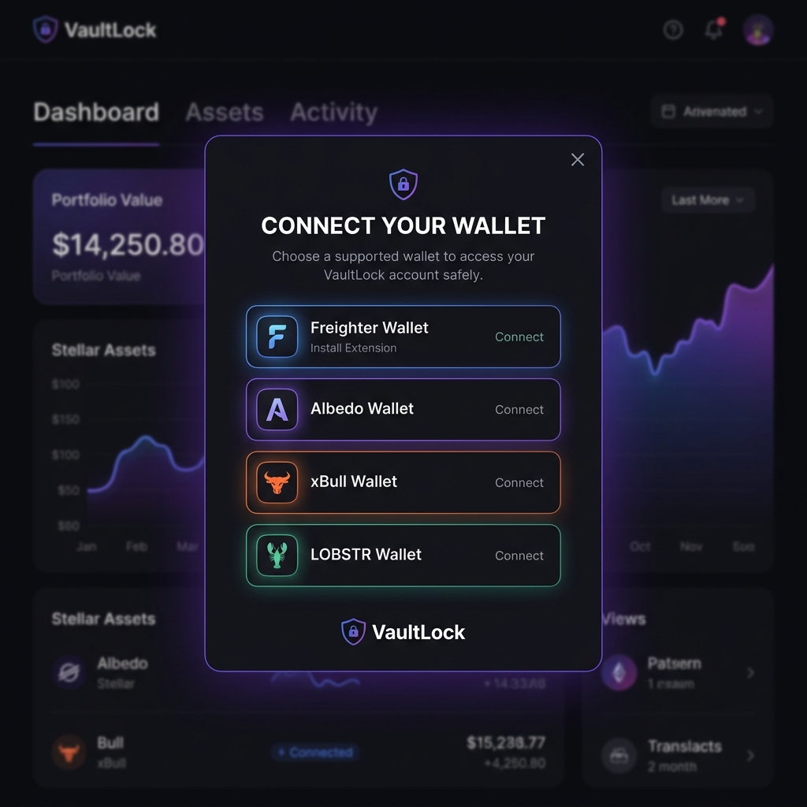
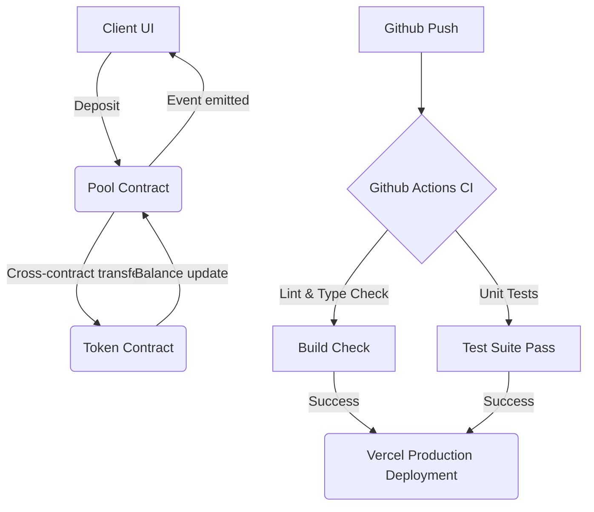

# VaultLock 🛡️

VaultLock is a decentralized, milestone-based escrow platform built on **Stellar Soroban Smart Contracts**. It allows clients to lock funds on-chain, which are only released to freelancers upon successful milestone completion, ensuring trust and security for both parties.

## 🚀 Live Demo
[View Live Demo](https://vaultlock.vercel.app) *(Placeholder - update with your actual deployment link)*

## 📦 Features
- **SEP-41 Token Standard**: Full compatibility with the Soroban token interface.
- **Milestone-Based Payments**: Funds are secured in claimable balances.
- **Multi-Wallet Support**: Native integration with Freighter, Albedo, and xBull.
- **Real-Time Dashboards**: Separate specialized views for Clients and Freelancers.

## 🖼️ Screenshots

### Wallet Options Available


## 🛠️ Setup Instructions

### Prerequisites
- **Node.js**: v20+ (LTS recommended)
- **MongoDB**: Local or Atlas instance
- **Stellar Wallet**: Freighter or Albedo browser extension

### Installation

1. **Clone the repository**:
   ```bash
   git clone https://github.com/parth1241/vaultlock.git
   cd vaultlock
   ```

2. **Install dependencies**:
   ```bash
   npm install
   ```

3. **Environment Setup**:
   Create a `.env.local` file in the root directory and add the following:
   ```env
   MONGODB_URI=mongodb://localhost:27017/vaultlock
   NEXTAUTH_SECRET=your_random_secret_here
   NEXTAUTH_URL=http://localhost:3000
   NEXT_PUBLIC_TOKEN_CONTRACT_ID=CDCMF2JJNJBT64O7LBZQTQ2IJZ4EYTBMHWFZFZB3LLZGMUP52X3TCBVE
   NEXT_PUBLIC_POOL_CONTRACT_ID=CANRLOYU23VXBUDWWOC4PEAM2QSBVZM4PMWLQUCW3QCW6DAWPDX5LPSN
   NEXT_PUBLIC_STELLAR_NETWORK=testnet
   NEXT_PUBLIC_SOROBAN_RPC=https://soroban-testnet.stellar.org:443
   ```

4. **Run the Development Server**:
   ```bash
   npm run dev
   ```
   Open [http://localhost:3000](http://localhost:3000) to view the app.

## 📜 Smart Contracts (Testnet)

| Contract | Contract ID |
| :--- | :--- |
| **Custom Token (TOK)** | `CDCMF2JJNJBT64O7LBZQTQ2IJZ4EYTBMHWFZFZB3LLZGMUP52X3TCBVE` |
| **Liquidity Pool** | `CANRLOYU23VXBUDWWOC4PEAM2QSBVZM4PMWLQUCW3QCW6DAWPDX5LPSN` |

### Verified Transaction Hashes
- **Pool Deposit calling Token transfer_from**: `4cb72575636c3cd250c6b1ba4cb6be829969d8a446c29f7cc40ba4c7a5c00741`
- **Successful Pool Approval**: `1183bdac6e2e27b8d0f308e631e6662dd85ec5997ebb06c9f830ee3a1dde1488`

## 🧪 Testing

Run vitest unit tests:
```bash
npm run test
```

## 🏗️ Architecture


