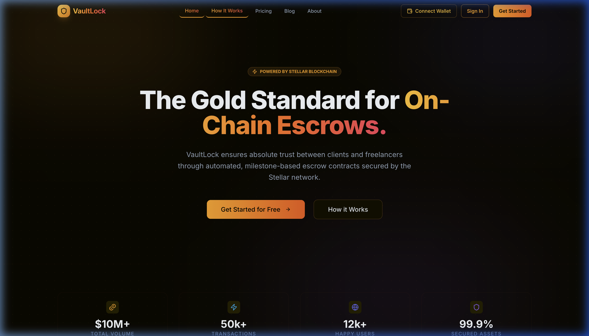
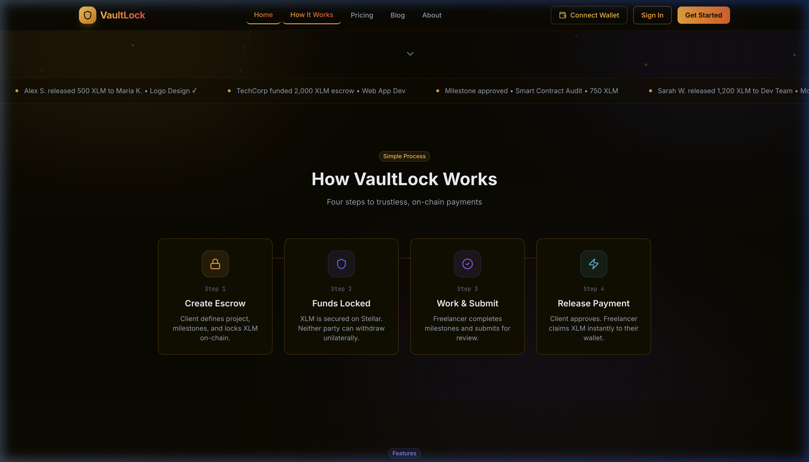
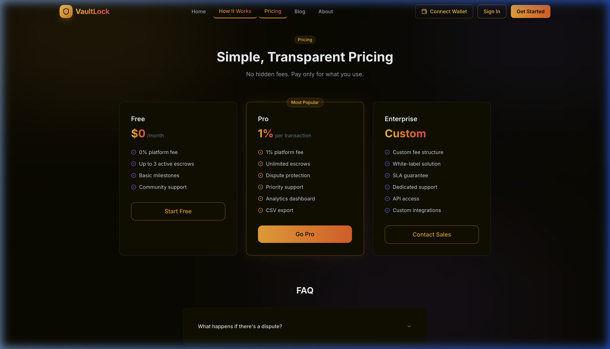
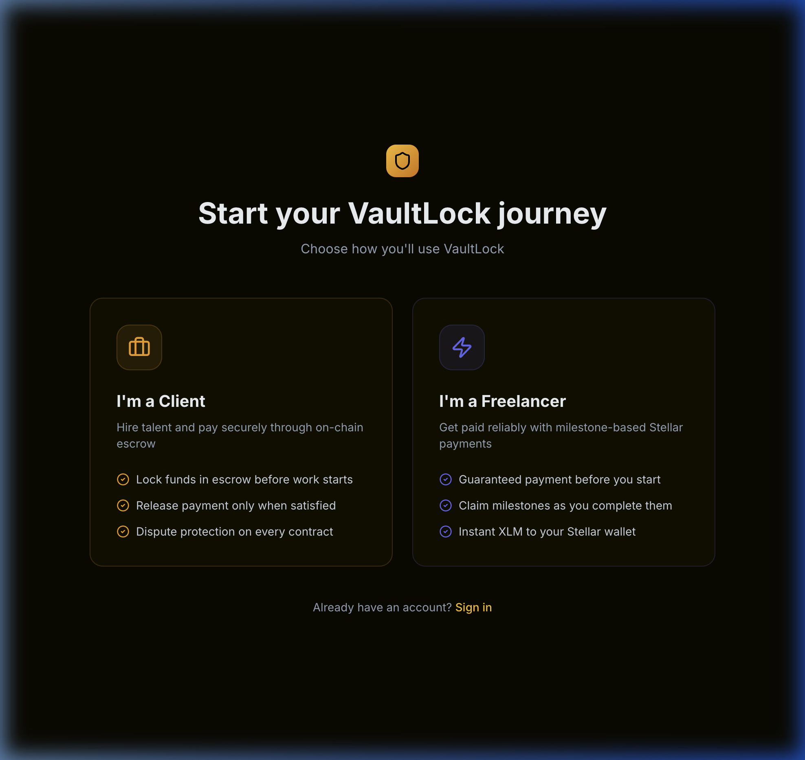

<div align="center">
  

  <h1>VaultLock</h1>
  <p><strong>The Gold Standard for On-Chain Escrows.</strong></p>

  <p>
    Built on the <a href="https://stellar.org/">Stellar Blockchain</a> • Automated & Trustless • Milestone-based Payments
  </p>

  <br />
</div>

## 🛡️ About VaultLock

VaultLock ensures absolute trust between clients and freelancers through automated, milestone-based escrow contracts secured by the Stellar network.

Gone are the days of unfulfilled invoices and untrustworthy escrows. VaultLock integrates deeply with Stellar's modern **Claimable Balances** to lock funds upfront and release them instantly as milestones are verified. 

Featuring a premium Glassmorphic dark theme and completely custom UI, VaultLock is not just functionally robust—it’s beautifully designed to be the definitive platform for digital talent and their clients.

---

## ✨ Key Features

### For Clients
- **Secure Deposits**: Lock funds in escrow before work begins. Neither party can withdraw unilaterally.
- **Milestone Verification**: Release payments seamlessly only when satisfied with the milestone submission.
- **Dispute Protection**: Built-in mechanisms to protect your funds on every contract.

### For Freelancers
- **Guaranteed Payment**: Verify that funds are securely locked in the smart contract before you start working.
- **Instant Claiming**: Claim milestones directly into your Stellar wallet instantly after approval via the Freighter API.
- **Zero Platform Hold**: VaultLock never takes custody of funds, meaning no withdrawal limits or bank holds.

---

## 📸 Screenshots

### The Modern Pipeline
Beautiful, step-by-step visualizations so both parties know exactly what to do next.



### Simple, Transparent Pricing
Sleek tier presentation with an enterprise custom offering.



### Freelancer / Client Login Workflows
Tailored dashboard experiences based on the actor's role.



---

## 🚀 Tech Stack

- **Framework:** Next.js 14 (App Router)
- **Styling:** Tailwind CSS (Dark Mode, Custom Animations, Glassmorphism)
- **Icons & Visuals:** Lucide React, Recharts
- **Blockchain:** Stellar SDK (`@stellar/stellar-sdk`, `@stellar/freighter-api`)
- **Database:** MongoDB & Mongoose
- **Authentication:** NextAuth.js

---

## 💻 Getting Started

### Prerequisites
- Node.js > 18.x
- MongoDB Instance (Atlas or Local)
- Testnet Stellar Freighter Wallet (for blockchain operations)

### Installation

1. **Clone the repository:**
   ```bash
   git clone https://github.com/your-username/vaultlock.git
   cd vaultlock
   ```

2. **Install dependencies:**
   ```bash
   npm install
   ```

3. **Configure Environment Variables:**
   Create a `.env.local` in the root and add the following keys:
   ```env
   # Database
   MONGODB_URI=your_mongodb_connection_string

   # Authentication
   NEXTAUTH_URL=http://localhost:3000
   NEXTAUTH_SECRET=your_super_secret_string

   # Encryption for Escrow Private Keys
   ESCROW_ENCRYPTION_KEY=32_byte_hex_string

   # Stellar Configuration
   NEXT_PUBLIC_STELLAR_NETWORK=TESTNET
   NEXT_PUBLIC_STELLAR_HORIZON=https://horizon-testnet.stellar.org
   ```

4. **Launch the Dev Server:**
   ```bash
   npm run dev
   ```

Open `http://localhost:3000` to view VaultLock in action!

---

<div align="center">
  <p>Built with 🧡 for the Stellar Ecosystem</p>
</div>
